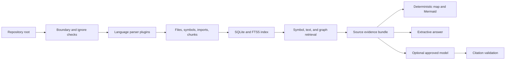

# Architecture

DevPilot deliberately separates deterministic evidence production from optional model
explanation.

## Components

- `scanner/` owns bounded discovery, ignore policy, binary and sensitive-file exclusion.
- `parsers/` turns accepted text into symbols, dependencies, entry-point flags, and semantic
  chunks. Parser output is always a static approximation.
- `index/` stores repository facts in a schema-versioned SQLite database outside the repository.
  Updates compare content hashes, so unchanged files retain their rows.
- `retrieval/` combines symbol matches, FTS5/BM25 results, and static dependency neighbors.
- `generators/` creates `PROJECT_MAP.md` and a restricted Mermaid subset without model output.
- `providers/` provides a narrow text-generation contract. It cannot read files or invoke tools.
- `security/` enforces canonical paths, output redaction, and per-repository cloud consent.
- `core/` is the workflow boundary shared by the CLI and optional API.

## Data invariants

All stored and returned paths are POSIX-style and relative to one canonical repository root.
Source lines are one-based and inclusive. Every symbol and chunk has a concrete line range.
Index updates occur in a transaction. Retrieval never expands beyond indexed chunks. Provider
context is redacted and bounded by a character budget. A provider answer is displayed only when
all structured citation markers resolve inside retrieved evidence.

## Cache lifecycle

The canonical repository path is hashed to choose an opaque database name under the user cache
directory. The database records its canonical root and schema/parser versions. A scan removes
rows for deleted files, replaces rows for changed hashes, and leaves identical hashes untouched.
`devpilot clean` deletes only that database and its SQLite sidecars.

For a compatible analysis version, the scanner safely re-reads and hashes candidate files but
reuses stored parser facts when the bytes are identical. This avoids trusting timestamps alone,
while skipping AST/heuristic parsing and SQLite replacement for unchanged files. Parser or chunk
policy changes alter the analysis version and force full fact regeneration.

## Extension points

New language parsers must return the shared `Symbol`, `Dependency`, and `Chunk` types. New model
providers implement the provider contract and declare whether they are local. Future vector
retrieval may add candidates, but exact symbol and FTS evidence remain independently available.
