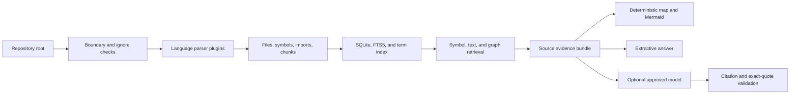

# Architecture

RepoLocus deliberately separates deterministic evidence production from optional model
explanation.

## Components

- `scanner/` owns bounded discovery, ignore policy, binary and sensitive-file exclusion.
- `parsers/` turns accepted text into symbols, dependencies, entry-point flags, and semantic
  chunks. Parser output is always a static approximation.
- `index/` stores repository facts in a schema-versioned SQLite database outside the repository.
  Updates compare content hashes, track source/generated provenance and stale state, and commit
  against a monotonic generation.
- `retrieval/` combines symbol matches, FTS5/BM25 results, deterministic lexical terms, and static
  dependency neighbors. Terms split camelCase, snake_case, and paths and include CJK bigrams and
  trigrams. Bounded user synonyms can come from `REPOLOCUS_QUERY_SYNONYMS`; target-repository
  configuration cannot choose them.
- `generators/` creates `PROJECT_MAP.md` and a restricted Mermaid subset without model output.
  Each rendered cross-node edge retains one concrete import dependency as its evidence witness.
- `providers/` provides a narrow text-generation contract. It cannot read files or invoke tools;
  remote adapters prepare a credential-free, immutable serialized request body before approval.
- `security/` enforces canonical paths, output redaction, and per-repository/provider/endpoint
  cloud consent.
- `core/` is the workflow boundary shared by the CLI and optional API.
- `api/` authenticates requests, bounds exposure, and holds short-lived single-use preview
  snapshots for two-stage cloud approval.

## Data invariants

All stored and returned paths are POSIX-style and relative to one canonical repository root.
Source lines are one-based and inclusive. Every symbol and chunk has a concrete line range.
Index updates occur in a transaction. Retrieval never expands beyond indexed chunks. Provider
context is redacted and bounded by a character budget. Every material provider claim must be
followed by an exact source quote using the same citation. Display validation proves only that the
citation lies inside a retrieved range and the quote is a substring of that range; it does not
prove semantic entailment, so accepted provider output remains `needs_review`. A prepared cloud
question freezes its model, canonical endpoint, bounded evidence, prompts, and serialized request
body; execution consumes those values rather than retrieving the evidence again.

## Snapshot and index lifecycle

The canonical repository path is hashed to choose an opaque database name under the user cache
directory. The database records its canonical root, schema/parser versions, and monotonic commit
generation. `map`, `diagram`, and `ask` use `refresh=auto` by default: a compatible committed
snapshot is queried without scanning, while a missing or incompatible snapshot triggers a scan.
`refresh=always` scans first; `refresh=never` forbids scanning and fails closed without a compatible
snapshot. Callers can also pin an expected generation. CLI follow-up sessions pin the first
answer's generation and use `refresh=never`, so a concurrent generation change ends the session.

Recognized RepoLocus-generated documents are excluded by the scanner. The schema also retains
`generated` provenance for migrated or explicitly imported rows, and retrieval excludes those
rows. If a scan is incomplete or a path is temporarily unreadable, prior facts for that path are
retained as `stale`; a confirmed deletion removes them. Query snapshots and retrieval SQL admit
only non-stale `source` facts, preventing generated output or uncertain old content from becoming
evidence.

Each scan starts from one SQLite snapshot and commits with a generation compare-and-swap. An old
scan cannot overwrite a newer commit. Unpinned scans may retry from the new generation, while a
caller that pinned a generation fails closed. `repolocus clean` deletes only that database and its
SQLite sidecars.

For a compatible analysis version, the scanner safely re-reads and hashes candidate files but
reuses stored parser facts when the bytes are identical. This avoids trusting timestamps alone,
while skipping AST/heuristic parsing and SQLite replacement for unchanged files. Parser or chunk
policy changes alter the analysis version and force full fact regeneration. This is content-hash
fact reuse after bounded discovery, not a manifest-delta watcher.

## Extension points

New language parsers must return the shared `Symbol`, `Dependency`, and `Chunk` types. New model
providers implement the provider contract and declare whether they are local. Future vector
retrieval may add candidates, but exact symbol and FTS evidence remain independently available.
